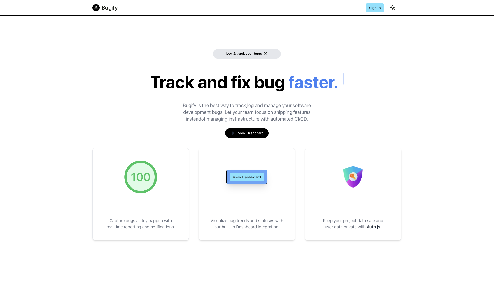
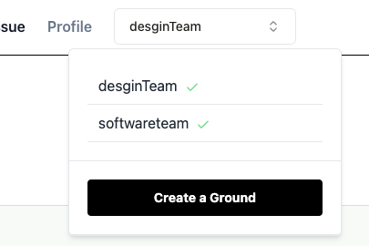
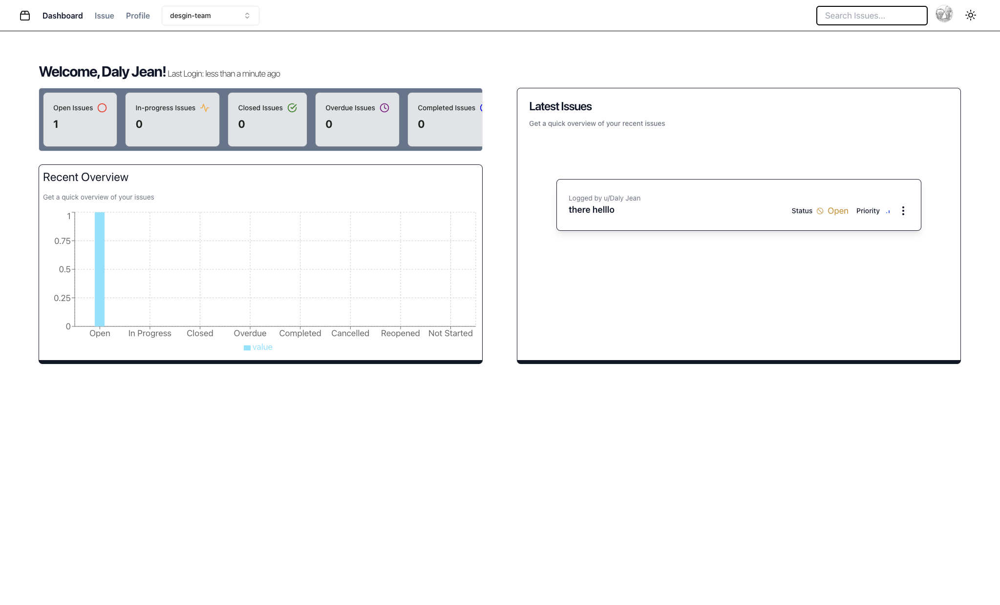
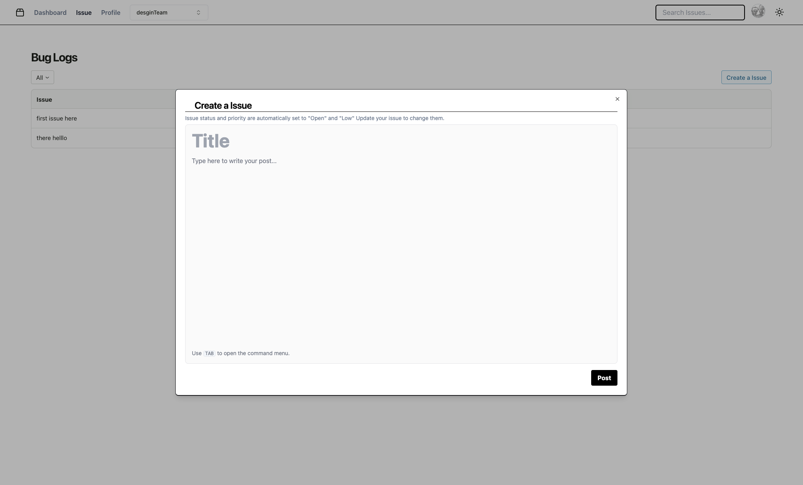
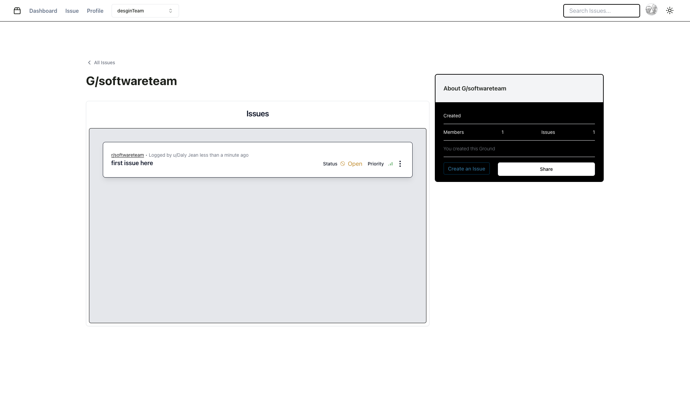

# Bugify

Bugify is an open-source software designed to enhance workflow management within software development teams and organizations. This tool is built using robust technologies such as TypeScript and Next.js, ensuring a scalable and maintainable codebase. It offers a suite of features aimed at improving project oversight, task management, and resource allocation, making it easier for teams to meet deadlines and manage workloads efficiently.
Key functionalities include real-time collaboration tools that allow team members to update each other on progress without delays, a customizable interface that can be tailored to specific organizational needs, and comprehensive dashboards for tracking project statuses and milestones. Additionally, the intuitive design ensures that even users with minimal technical expertise can navigate and use the software effectively.
By leveraging Bugify, teams can expect streamlined operations, enhanced productivity, and improved project outcomes. It is particularly beneficial for organizations looking to optimize their workflow and foster a collaborative work environment. Contributions to further enhance the tool are welcomed, with guidelines available for interested developers.



## Key Features

- **Streamlined Workflow Management:** Seamlessly manage projects, tasks, and resources to optimize workflow efficiency.

- **Comprehensive Dashboards** Features detailed dashboards for tracking project statuses, milestones, and overall progress, which helps in making informed decisions and keeping projects on track.

- **Efficient Resource Allocation:** Enables efficient allocation of resources and task management, ensuring optimal utilization of team capabilities and timely project delivery.

- **Enhanced Productivity Tools:** Integrates tools that boost productivity, such as automated task scheduling and progress tracking, which streamline project workflows.

- **Collaborative Environment** Facilitates a collaborative work environment with tools that support real-time communication and updates, allowing for seamless teamwork.



## Getting Started

To get started with Bugify, follow these steps:

1. **Clone the Repository:**
```bash
git clone https://github.com/artistatbl/Bugify.git
```

2. **Install Dependencies:**
```bash
cd Bugify


3. **Ensure Node.js Version:**
Ensure you have the latest version of Node.js installed, preferably version 18 or higher. You can check your Node version by running: If you need to update or install Node.js, visit [Node.js official website](https://nodejs.org/).

4. **Environment Setup:**
Check the `.env` file for necessary environment variables and update them as needed. If `.env` file is not present, refer to `.env.example` for the required variables.


5. **Run the Development Server:**
npm install

```

6. **Run the Development Server:**
```
npm run dev
```


7. **Open in Browser:**
```
http://localhost:3000
```


## Contributing

Contributions are welcome! If you'd like to contribute to Bugify, please follow these guidelines:

- Fork the repository and create your branch from `main`.
- Make sure your code adheres to the established code style.
- Ensure your commits are descriptive and well-documented.
- Open a pull request, describing the changes you've made.

## License

Bugify is licensed under the [MIT License](LICENSE).

## Support

For support, bug reports, or feature requests, please [open an issue](https://github.com/artistatbl/Bugify/issues).

## Acknowledgements

Bugify is built using the following technologies and libraries:

- TypeScript
- Next.js
- React
- Prisma
- TailwindCSS
- Framer Motion
- React Query
- T3 Stack
- PostgreSQL
- Vercel
- Shadcn UI
- Lucide React Icons
- Vite
- Editor.js
- zod
- Sentry
- Rechart
- and more...

## About

Bugify is developed and maintained by [artistatbl](https://bugify.vercel.app).

